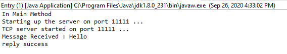
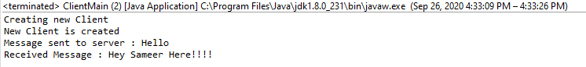
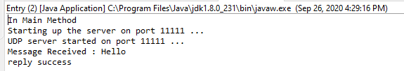
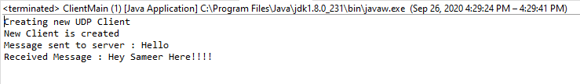

# Netty-Simple-UDP-TCP-server-client

    
    
    
    
    
    

Netty is a NIO client server framework which enables quick and easy development of network applications such as protocol servers and clients. It greatly simplifies and streamlines network programming such as TCP and UDP socket server.
 
Here, The simple TCP and UDP server/client examples are provided. Feel free to use it.
  

## Author 
Sameer Narkhede  
Profile : https://github.com/narkhedesam  
Website : https://narkhedesam.github.io/ 

## Take a look here

 

## Donation

If this project help you reduce time to develop, you can give me a cup of coffee :relaxed: 
 

 
